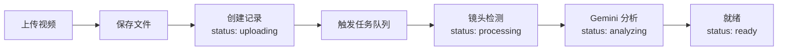

# DramaGen AI

> 智能化短剧视频生产工具 - 从原始长视频到高点击短视频的自动化/半自动化产出

[](https://www.typescriptlang.org/)
[](https://nextjs.org/)
[](LICENSE)

---

## 📖 项目简介

DramaGen AI 是一款面向短剧/漫剧剪辑师、投放运营及自媒体博主的智能化视频生产工具。系统深度集成 **Gemini 3** 的多模态理解能力，实现从原始长视频到高点击短视频的自动化产出。

### 核心功能

#### 🎬 模式 A：高光智能切片
自动识别并提取视频中的病毒传播时刻，支持毫秒级精度调整
- AI 检测病毒式传播桥段（反转、身份曝光、冲突爆发）
- 毫秒级手动微调（±100ms、±500ms、±1000ms）
- 切点实时预览
- 帧级精确切割

#### 🎙️ 模式 B：深度解说矩阵
从故事线生成多版本解说文案，自动实现音画匹配
- 提取 ≥10 条独立故事线
- 生成多种解说风格（悬念钩子版、吐槽版、情绪共鸣版）
- TTS 合成 + 语义画面匹配
- 四轨音频混音（解说 + 原音 + BGM）

---

## ✨ 当前状态

**版本**: v0.1.0  
**更新时间**: 2025-02-08

### 已完成 ✅

| 模块 | 状态 | 完成度 |
|------|------|--------|
| **素材管理** | ✅ 完成 | 100% |
| - 项目管理（CRUD + 搜索） | ✅ | 100% |
| - 视频管理（上传 + 删除） | ✅ | 100% |
| - **自动化处理流程** | ✅ | 100% |
| - 任务队列系统 | ✅ | 100% |
| - 数据层架构 | ✅ | 100% |

### 待开发 🚧

| 模块 | 状态 | 完成度 |
|------|------|--------|
| **高光切片模式** | 🚧 开发中 | 20% |
| **深度解说模式** | ⏳ 待开发 | 0% |
| **任务管理 UI** | ⏳ 待开发 | 0% |

---

## 🛠️ 技术栈

### 前端
- **框架**: Next.js 15 (App Router)
- **语言**: TypeScript 5.0
- **样式**: Tailwind CSS
- **UI 组件**: shadcn/ui (Radix UI)
- **动画**: Framer Motion
- **状态管理**: React Hooks

### 后端
- **框架**: Next.js 15 (API Routes)
- **数据库**: SQLite + Drizzle ORM
- **任务队列**: BullMQ + Redis
- **实时通信**: WebSocket (ws)
- **视频处理**: FFmpeg (fluent-ffmpeg)

### AI 服务
- **视频分析**: Gemini 3
- **语音合成**: ElevenLabs TTS

---

## 🚀 快速开始

### 环境要求

- Node.js >= 18.0.0
- Redis >= 6.0
- FFmpeg >= 5.0

### 安装依赖

```bash
npm install
```

### 配置环境变量

创建 `.env.local` 文件：

```env
# Gemini API
GEMINI_API_KEY=your_gemini_api_key
YUNWU_API_ENDPOINT=https://your_yunwu_endpoint

# ElevenLabs API
ELEVENLABS_API_KEY=your_elevenlabs_api_key

# Redis
REDIS_HOST=localhost
REDIS_PORT=6379
REDIS_PASSWORD=
REDIS_DB=0

# 应用配置
NODE_ENV=development
PORT=3000
```

### 初始化数据库

```bash
npm run db:push
```

### 启动服务

```bash
# 开发模式（启动 Next.js + Workers）
npm run dev

# 生产模式
npm run build
npm run start

# 独立启动 Workers
npm run workers
npm run workers:dev  # 开发模式（热重载）
```

### 访问应用

打开浏览器访问：http://localhost:3000

---

## 📁 项目结构

```
dramagen-ai/
├── app/                      # Next.js App Router
│   ├── projects/            # 项目管理页面
│   │   ├── page.tsx         # 项目列表
│   │   └── [id]/            # 项目详情
│   │       └── page.tsx
│   └── api/                 # API 路由
│       ├── projects/        # 项目 API
│       ├── videos/          # 视频 API
│       └── upload/          # 文件上传 API
│
├── components/              # React 组件
│   ├── ui/                  # shadcn/ui 组件
│   ├── create-project-dialog.tsx
│   ├── edit-project-dialog.tsx
│   └── upload-video-dialog.tsx
│
├── lib/                     # 核心库
│   ├── api/                 # API 客户端
│   │   ├── gemini.ts        # Gemini 客户端
│   │   └── elevenlabs.ts    # ElevenLabs 客户端
│   ├── db/                  # 数据库
│   │   ├── schema.ts        # Drizzle Schema
│   │   ├── client.ts        # SQLite 客户端
│   │   └── queries.ts       # 查询接口
│   ├── queue/               # 任务队列
│   │   ├── bullmq.ts        # BullMQ 管理器
│   │   └── workers.ts       # Worker 处理器
│   ├── ws/                  # WebSocket
│   │   └── server.ts        # WebSocket 服务器
│   └── server.ts            # 自定义服务器
│
├── scripts/                 # 脚本
│   └── workers.ts           # Worker 启动脚本
│
└── uploads/                 # 文件上传目录
```

---

## 🔑 核心功能

### 1. 素材管理

#### 项目管理
- 创建项目（名称 + 描述）
- 编辑项目信息
- 删除项目（级联删除所有视频）
- 搜索项目（实时搜索）

#### 视频管理
- 上传视频（支持多文件）
- 删除视频（物理文件 + 数据库记录）
- 查看视频元数据（时长、分辨率、帧率等）

#### 自动化处理流程 ⭐



**技术实现**：
- 异步非阻塞设计（上传 API 立即返回）
- 任务队列自动处理（BullMQ + Redis）
- 状态机管理（uploading → processing → analyzing → ready）
- 实时进度推送（WebSocket）

---

## 📊 数据库架构

### 表结构

| 表名 | 说明 | 字段数 |
|------|------|--------|
| `projects` | 项目信息 | 8 |
| `videos` | 视频信息 | 13 |
| `shots` | 镜头切片 | 13 |
| `storylines` | 故事线 | 7 |
| `highlights` | 高光候选 | 8 |
| `recap_tasks` | 解说任务 | 7 |
| `recap_segments` | 解说片段 | 7 |
| `queue_jobs` | 队列任务记录 | 8 |

### 关系

```
projects (1) ────< (N) videos (1) ────< (N) shots
                                 │
                                 ├──> (N) highlights
                                 │
storylines (1) ────< (N) recap_tasks (1) ────< (N) recap_segments
     │                                    │
     └──────────< videos ──────────────────┘
```

---

## 🔧 配置说明

### 任务队列配置

```typescript
// lib/config/index.ts
export const queueConfig = {
  redis: {
    host: 'localhost',
    port: 6379,
    password: undefined,
    db: 0,
  },
  maxConcurrentJobs: 3,
  retryAttempts: 3,
  retryDelay: 5000,
  queues: {
    videoProcessing: 'video-processing',
    geminiAnalysis: 'gemini-analysis',
    ttsGeneration: 'tts-generation',
    videoRender: 'video-render',
  },
};
```

### WebSocket 配置

```typescript
export const wsConfig = {
  port: 3001,
  heartbeatInterval: 30000,
  maxConnections: 100,
};
```

---

## 📚 API 文档

### 项目管理

```
GET    /api/projects              # 获取项目列表
POST   /api/projects              # 创建项目
GET    /api/projects/:id          # 获取项目详情
PUT    /api/projects/:id          # 更新项目
DELETE /api/projects/:id          # 删除项目
GET    /api/projects/search?q=关键词  # 搜索项目
```

### 视频管理

```
GET    /api/projects/:id/videos   # 获取项目视频列表
POST   /api/projects/:id/videos   # 上传视频
DELETE /api/videos/:id            # 删除视频
POST   /api/upload                # 文件上传（带元数据提取）
```

---

## 🧪 测试

```bash
# 运行测试
npm test

# 运行测试（监听模式）
npm run test:watch

# 测试覆盖率
npm run test:coverage
```

---

## 📖 文档

- **[项目状态总览](PROJECT-STATUS.md)** - 功能完成度和技术架构
- **[Agent 4 指南](AGENT-4-GUIDE.md)** - 数据层开发指南
- **[自动化处理流程](AGENT-4-AUTO-PROCESSING-PIPELINE.md)** - 任务队列详解
- **[协作文档](COLLABORATION.md)** - Agent 协作机制
- **[部署指南](DEPLOYMENT.md)** - 部署说明

---

## 🤝 贡献指南

欢迎贡献！请先查看 [CLAUDE.md](CLAUDE.md) 了解项目规范。

### 开发流程

1. Fork 本仓库
2. 创建特性分支 (`git checkout -b feature/AmazingFeature`)
3. 提交更改 (`git commit -m 'feat: Add some AmazingFeature'`)
4. 推送到分支 (`git push origin feature/AmazingFeature`)
5. 开启 Pull Request

---

## 📝 许可证

本项目采用 MIT 许可证 - 详见 [LICENSE](LICENSE) 文件

---

## 🙏 致谢

- [Next.js](https://nextjs.org/)
- [Drizzle ORM](https://orm.drizzle.team/)
- [BullMQ](https://docs.bullmq.io/)
- [shadcn/ui](https://ui.shadcn.com/)
- [Gemini](https://ai.google.dev/)
- [ElevenLabs](https://elevenlabs.io/)

---

**Made with ❤️ by DramaGen AI Team**
