# DramaGen AI

> 智能化短剧视频生产工具 - 从原始长视频到高点击短视频的自动化/半自动化产出

[](https://www.typescriptlang.org/)
[](https://nextjs.org/)
[](LICENSE)

---

## 📖 项目简介

DramaGen AI 是一款面向短剧/漫剧剪辑师、投放运营及自媒体博主的智能化视频生产工具。系统深度集成 **Gemini 3** 的多模态理解能力，实现从原始长视频到高点击短视频的自动化产出。

### 核心功能

#### 🎬 模式 A：高光智能切片
自动识别并提取视频中的病毒传播时刻，支持毫秒级精度调整
- AI 检测病毒式传播桥段（反转、身份曝光、冲突爆发）
- 毫秒级手动微调（±100ms、±500ms、±1000ms）
- 切点实时预览
- 帧级精确切割

#### 🎙️ 模式 B：深度解说矩阵
从故事线生成多版本解说文案，自动实现音画匹配
- 提取 ≥10 条独立故事线
- 生成多种解说风格（悬念钩子版、吐槽版、情绪共鸣版）
- TTS 合成 + 语义画面匹配
- 四轨音频混音（解说 + 原音 + BGM）

---

## ✨ 当前状态

**版本**: v0.5.0
**更新时间**: 2026-02-08

### 已完成 ✅

| 模块 | 状态 | 完成度 |
|------|------|--------|
| **基础设施** | ✅ 完成 | 100% |
| - 数据库（SQLite + Drizzle） | ✅ | 100% |
| - 任务队列（BullMQ + Redis） | ✅ | 100% |
| - WebSocket 实时通信 | ✅ | 100% |
| **素材管理** | ✅ 完成 | 95% |
| - 项目管理（CRUD + 搜索） | ✅ | 100% |
| - 视频管理（上传 + 删除） | ✅ | 100% |
| **视频处理核心** | ✅ 完成 | 100% |
| - 关键帧采样 | ✅ | 100% |
| - FFmpeg 进度监控 | ✅ | 100% |
| - 视频拼接（concat） | ✅ | 100% |
| - 多轨道音频混合 | ✅ | 100% |
| - Remotion 渲染客户端 | ✅ | 100% |
| - 多片段组合组件 | ✅ | 100% |
| **AI 服务集成** | ✅ 完成 | 100% |
| - Gemini 多模态理解 | ✅ | 100% |
| - 病毒式时刻检测 | ✅ | 100% |
| - 剧情线提取 | ✅ | 100% |
| - 解说文案生成 | ✅ | 100% |
| - ElevenLabs TTS 客户端 | ✅ | 100% |
| **自动化处理流程** | ✅ 完成 | 100% |
| - 任务队列系统 | ✅ | 100% |
| - 数据层架构 | ✅ | 100% |

### 部分完成 🟡

| 模块 | 状态 | 完成度 |
|------|------|--------|
| **深度解说模式** | 🟡 部分完成 | 60% |
| - 解说模式 UI | ✅ | 100% |
| - 故事线提取 API | ✅ | 100% |
| - 解说文案生成 | ✅ | 100% |
| - TTS 音频合成 | ✅ | 100% |
| - 画面自动匹配 | 🔴 待开发 | 0% |
| - Remotion 渲染集成 | 🔴 待开发 | 0% |
| **任务管理** | 🟡 部分完成 | 80% |
| - 任务列表 UI | ✅ | 100% |
| - 任务状态监控 | ✅ | 100% |
| - 任务详情查看 | 🔴 待开发 | 0% |

### 待开发 🚧

| 模块 | 状态 | 完成度 |
|------|------|--------|
| **高光切片模式** | 🔴 未开发 | 0% |
| - AI 高光检测 | 🔴 待开发 | 0% |
| - 毫秒级微调 UI | 🔴 待开发 | 0% |
| - 实时预览功能 | 🔴 待开发 | 0% |
| - 批量切片生成 | 🔴 待开发 | 0% |
| **音画匹配系统** | 🔴 未开发 | 0% |
| - 语义向量化 | 🔴 待开发 | 0% |
| - 相似度匹配算法 | 🔴 待开发 | 0% |
| - 候选画面推荐 | 🔴 待开发 | 0% |

**详细路线图**: 请查看 [ROADMAP.md](./ROADMAP.md) 和 [IMPLEMENTATION.md](./IMPLEMENTATION.md)

---

## 🛠️ 技术栈

### 前端
- **框架**: Next.js 15 (App Router)
- **语言**: TypeScript 5.0
- **样式**: Tailwind CSS
- **UI 组件**: shadcn/ui (Radix UI)
- **动画**: Framer Motion
- **状态管理**: React Hooks

### 后端
- **框架**: Next.js 15 (API Routes)
- **数据库**: SQLite + Drizzle ORM
- **任务队列**: BullMQ + Redis
- **实时通信**: WebSocket (ws)
- **视频处理**: FFmpeg (fluent-ffmpeg)

### AI 服务
- **视频分析**: Gemini 3
- **语音合成**: ElevenLabs TTS

---

## 🚀 快速开始

### 环境要求

- Node.js >= 18.0.0
- Redis >= 6.0
- FFmpeg >= 5.0

### 安装依赖

```bash
npm install
```

### 配置环境变量

创建 `.env.local` 文件：

```env
# Gemini API
GEMINI_API_KEY=your_gemini_api_key
YUNWU_API_ENDPOINT=https://your_yunwu_endpoint

# ElevenLabs API
ELEVENLABS_API_KEY=your_elevenlabs_api_key

# Redis
REDIS_HOST=localhost
REDIS_PORT=6379
REDIS_PASSWORD=
REDIS_DB=0

# 应用配置
NODE_ENV=development
PORT=3000
```

### 初始化数据库

```bash
npm run db:push
```

### 启动服务

```bash
# 开发模式（启动 Next.js + Workers）
npm run dev

# 生产模式
npm run build
npm run start

# 独立启动 Workers
npm run workers
npm run workers:dev  # 开发模式（热重载）
```

### 访问应用

打开浏览器访问：http://localhost:3000

---

## 📁 项目结构

```
dramagen-ai/
├── app/                      # Next.js App Router
│   ├── projects/            # 项目管理页面
│   │   ├── page.tsx         # 项目列表
│   │   └── [id]/            # 项目详情
│   │       └── page.tsx
│   └── api/                 # API 路由
│       ├── projects/        # 项目 API
│       ├── videos/          # 视频 API
│       └── upload/          # 文件上传 API
│
├── components/              # React 组件
│   ├── ui/                  # shadcn/ui 组件
│   ├── create-project-dialog.tsx
│   ├── edit-project-dialog.tsx
│   └── upload-video-dialog.tsx
│
├── lib/                     # 核心库
│   ├── api/                 # API 客户端
│   │   ├── gemini.ts        # Gemini 3 客户端 ✅
│   │   ├── elevenlabs.ts    # ElevenLabs TTS 客户端 ✅
│   │   └── types.ts         # API 类型定义 ✅
│   ├── video/               # 视频处理模块 ✅
│   │   ├── metadata.ts      # 视频元数据提取 ✅
│   │   ├── shot-detection.ts # 镜头检测 ✅
│   │   ├── sampling.ts      # 关键帧采样 ✅
│   │   ├── db-integration.ts # 数据库集成 ✅
│   │   └── index.ts         # 导出入口 ✅
│   ├── ffmpeg/              # FFmpeg 工具库 ✅
│   │   ├── utils.ts         # 基础工具（裁剪、混音）✅
│   │   ├── progress.ts      # 进度监控 ✅
│   │   ├── concat.ts        # 视频拼接 ✅
│   │   ├── multitrack-audio.ts # 多轨道混音 ✅
│   │   ├── types.ts         # 类型定义 ✅
│   │   └── index.ts         # 导出入口 ✅
│   ├── remotion/            # Remotion 渲染模块 ✅
│   │   ├── renderer.ts      # 渲染客户端 ✅
│   │   └── index.ts         # 导出入口 ✅
│   ├── db/                  # 数据库
│   │   ├── schema.ts        # Drizzle Schema ✅
│   │   ├── client.ts        # SQLite 客户端 ✅
│   │   └── queries.ts       # 查询接口 ✅
│   ├── queue/               # 任务队列
│   │   ├── bullmq.ts        # BullMQ 管理器 ✅
│   │   └── workers.ts       # Worker 处理器 🟡
│   ├── server.ts            # 自定义服务器 ✅
│   └── config/              # 统一配置 ✅
│
├── components/              # React 组件
│   ├── remotion/            # Remotion 组件 ✅
│   │   ├── MultiClipComposition.tsx # 多片段组合 ✅
│   │   └── subtitles/       # 字幕组件 ✅
│   │       ├── CaptionedVideo.tsx
│   │       ├── KaraokeSentence.tsx
│   │       └── Word.tsx
│   └── ui/                  # shadcn/ui 组件
│
├── scripts/                 # 脚本
│   ├── test-sampling.ts     # 测试关键帧采样 ✅
│   ├── test-ffmpeg-progress.ts # 测试进度监控 ✅
│   ├── test-concat.ts       # 测试视频拼接 ✅
│   ├── test-multitrack-audio.ts # 测试多轨道混音 ✅
│   ├── test-remotion-renderer.ts # 测试 Remotion 渲染 ✅
│   └── test-multiclip.ts    # 测试多片段组合 ✅
│
├── docs/                   # 文档
│   ├── KEY-FRAME-SAMPLING.md # 关键帧采样文档 ✅
│   ├── FFMPEG-PROGRESS.md    # 进度监控文档 ✅
│   ├── VIDEO-CONCAT.md       # 视频拼接文档 ✅
│   ├── MULTITRACK-AUDIO.md  # 多轨道混音文档 ✅
│   ├── REMOTION-RENDERER.md  # Remotion 渲染文档 ✅
│   ├── MULTICLIP-COMPOSITION.md # 多片段组合文档 ✅
│   ├── API-SETUP.md         # API 配置指南 ✅
│   └── API-EXAMPLES.md       # API 使用示例 ✅
│
├── remotion/                # Remotion 配置
│   ├── config.ts            # Remotion 配置 ✅
│   └── root.tsx             # Remotion Root ✅
│
└── uploads/                 # 文件上传目录
```

---

## 🔑 核心功能

### 1. 视频处理核心 ⭐

#### 关键帧采样
- **均匀采样**: 按固定时间间隔采样
- **场景采样**: 基于镜头检测结果采样
- **代理分辨率**: 降低存储和 Token 消耗（90%+ 节省）
- **性能**: 2分钟视频 ~10秒完成采样

**使用**: `lib/video/sampling.ts`

#### FFmpeg 进度监控
- **实时进度解析**: 解析 FFmpeg stderr 输出
- **进度回调**: 支持毫秒级进度反馈
- **WebSocket 集成**: 实时更新到前端 UI
- **应用**: 视频裁剪、音频混合、帧率对齐

**使用**: `lib/ffmpeg/progress.ts`

#### 视频拼接
- **两种方法**: concat demuxer（快速）/ concat filter（高级）
- **转场效果**: 淡入淡出、交叉淡入淡出
- **批量处理**: 支持多批次拼接

**使用**: `lib/ffmpeg/concat.ts`

#### 多轨道音频混合
- **四轨道支持**: 解说配音、原音、BGM、音效
- **灵活音量控制**: 每个轨道独立音量调整
- **快速混合**: 使用 -c:v copy，视频不重新编码

**使用**: `lib/ffmpeg/multitrack-audio.ts`

#### Remotion 渲染客户端
- **程序化渲染**: 从 Node.js 代码调用 Remotion
- **实时进度**: 完整的渲染进度反馈
- **多片段组合**: 支持多个视频片段无缝拼接
- **转场效果**: 淡入淡出、滑动、缩放

**使用**: `lib/remotion/renderer.ts`

### 2. AI 服务集成

#### Gemini 3 API
- **视频分析**: 内容理解、摘要生成
- **高光检测**: 识别病毒式传播桥段
- **故事线提取**: 提取多条独立故事线
- **解说文案生成**: 多种风格解说

**使用**: `lib/api/gemini.ts`

#### ElevenLabs TTS
- **文本转语音**: 返回二进制音频
- **毫秒级时间轴**: 精确到词语级别
- **批量转换**: 支持多段文本转换
- **语音预览**: 支持语音试听

**使用**: `lib/api/elevenlabs.ts`

### 3. 素材管理

#### 项目管理
- 创建项目（名称 + 描述）
- 编辑项目信息
- 删除项目（级联删除所有视频）
- 搜索项目（实时搜索）

#### 视频管理
- 上传视频（支持多文件）
- 删除视频（物理文件 + 数据库记录）
- 查看视频元数据（时长、分辨率、帧率等）

#### 自动化处理流程 ⭐

```mermaid
graph LR
    A[上传视频] --> B[保存文件]
    B --> C[创建记录<br/>status: uploading]
    C --> D[触发任务队列]
    D --> E[镜头检测<br/>status: processing]
    E --> F[Gemini 分析<br/>status: analyzing]
    F --> G[就绪<br/>status: ready]
```



**技术实现**：
- 异步非阻塞设计（上传 API 立即返回）
- 任务队列自动处理（BullMQ + Redis）
- 状态机管理（uploading → processing → analyzing → ready）
- 实时进度推送（WebSocket）

---

## 📊 数据库架构

### 表结构

| 表名 | 说明 | 字段数 |
|------|------|--------|
| `projects` | 项目信息 | 8 |
| `videos` | 视频信息 | 13 |
| `shots` | 镜头切片 | 13 |
| `storylines` | 故事线 | 7 |
| `highlights` | 高光候选 | 8 |
| `recap_tasks` | 解说任务 | 7 |
| `recap_segments` | 解说片段 | 7 |
| `queue_jobs` | 队列任务记录 | 8 |

### 关系

```
projects (1) ────< (N) videos (1) ────< (N) shots
                                 │
                                 ├──> (N) highlights
                                 │
storylines (1) ────< (N) recap_tasks (1) ────< (N) recap_segments
     │                                    │
     └──────────< videos ──────────────────┘
```

---

## 🔧 配置说明

### 任务队列配置

```typescript
// lib/config/index.ts
export const queueConfig = {
  redis: {
    host: 'localhost',
    port: 6379,
    password: undefined,
    db: 0,
  },
  maxConcurrentJobs: 3,
  retryAttempts: 3,
  retryDelay: 5000,
  queues: {
    videoProcessing: 'video-processing',
    geminiAnalysis: 'gemini-analysis',
    ttsGeneration: 'tts-generation',
    videoRender: 'video-render',
  },
};
```

### WebSocket 配置

```typescript
export const wsConfig = {
  port: 3001,
  heartbeatInterval: 30000,
  maxConnections: 100,
};
```

---

## 📚 API 文档

### 项目管理

```
GET    /api/projects              # 获取项目列表
POST   /api/projects              # 创建项目
GET    /api/projects/:id          # 获取项目详情
PUT    /api/projects/:id          # 更新项目
DELETE /api/projects/:id          # 删除项目
GET    /api/projects/search?q=关键词  # 搜索项目
```

### 视频管理

```
GET    /api/projects/:id/videos   # 获取项目视频列表
POST   /api/projects/:id/videos   # 上传视频
DELETE /api/videos/:id            # 删除视频
POST   /api/upload                # 文件上传（带元数据提取）
```

---

## 🧪 测试

```bash
# 运行测试
npm test

# 运行测试（监听模式）
npm run test:watch

# 测试覆盖率
npm run test:coverage
```

---

## 📖 文档

### 项目文档
- **[项目路线图](ROADMAP.md)** - 完整的开发路线图和任务清单
- **[实施进度](IMPLEMENTATION.md)** - 功能完成度和技术细节
- **[CLAUDE.md](CLAUDE.md)** - 项目架构和开发规范

### 视频处理文档
- **[关键帧采样](docs/KEY-FRAME-SAMPLING.md)** - 降低 Gemini Token 消耗
- **[FFmpeg 进度监控](docs/FFMPEG-PROGRESS.md)** - 实时进度反馈
- **[视频拼接](docs/VIDEO-CONCAT.md)** - 视频片段拼接
- **[多轨道音频混合](docs/MULTITRACK-AUDIO.md)** - 四轨道混音
- **[Remotion 渲染客户端](docs/REMOTION-RENDERER.md)** - 程序化渲染
- **[多片段组合](docs/MULTICLIP-COMPOSITION.md)** - Remotion 组件

### API 文档
- **[API 配置指南](docs/API-SETUP.md)** - Gemini 3 和 ElevenLabs 配置
- **[API 使用示例](docs/API-EXAMPLES.md)** - 完整的 API 使用示例

### Agent 协作文档
- **[Agent 4 指南](AGENT-4-GUIDE.md)** - 数据层开发指南
- **[协作文档](COLLABORATION.md)** - Agent 协作机制
- **[部署指南](DEPLOYMENT.md)** - 部署说明

---

## 🤝 贡献指南

欢迎贡献！请先查看 [CLAUDE.md](CLAUDE.md) 了解项目规范。

### 开发流程

1. Fork 本仓库
2. 创建特性分支 (`git checkout -b feature/AmazingFeature`)
3. 提交更改 (`git commit -m 'feat: Add some AmazingFeature'`)
4. 推送到分支 (`git push origin feature/AmazingFeature`)
5. 开启 Pull Request

---

## 📝 许可证

本项目采用 MIT 许可证 - 详见 [LICENSE](LICENSE) 文件

---

## 🙏 致谢

- [Next.js](https://nextjs.org/)
- [Drizzle ORM](https://orm.drizzle.team/)
- [BullMQ](https://docs.bullmq.io/)
- [shadcn/ui](https://ui.shadcn.com/)
- [Gemini](https://ai.google.dev/)
- [ElevenLabs](https://elevenlabs.io/)

---

**Made with ❤️ by DramaGen AI Team**
