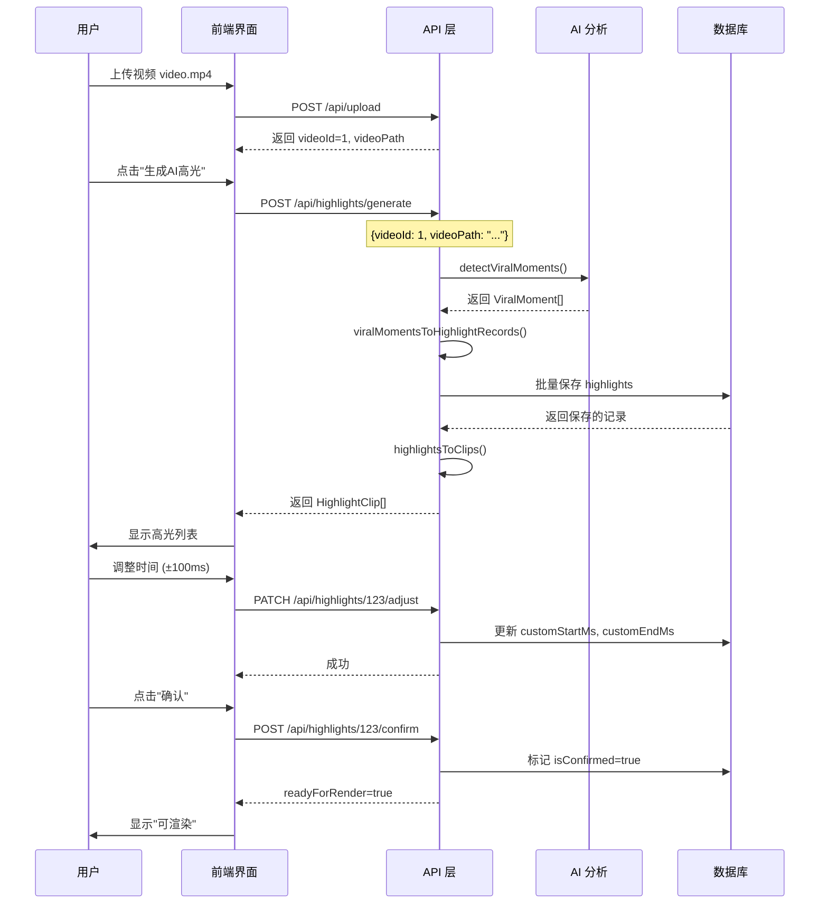

# P1 高光切片模式 - 完整集成文档

**创建时间**: 2026-02-08
**功能**: AI高光识别 → 数据库存储 → 前端展示的完整数据流

---

## 📦 架构概览

### 完整数据流程

```
┌─────────────────┐
│   视频文件      │
│  video.mp4      │
└────────┬────────┘
         │
         ▼
┌─────────────────────────────────────┐
│  Gemini AI 分析                     │
│  /api/gemini/detect-viral-moments   │
│  返回: ViralMoment[]                │
└────────┬────────────────────────────┘
         │
         ▼
┌─────────────────────────────────────┐
│  数据转换层                          │
│  viralMomentsToHighlightRecords()   │
│  ViralMoment → HighlightRecord      │
└────────┬────────────────────────────┘
         │
         ▼
┌─────────────────────────────────────┐
│  数据库存储                          │
│  POST /api/highlights/generate      │
│  highlights 表                      │
└────────┬────────────────────────────┘
         │
         ▼
┌─────────────────────────────────────┐
│  前端查询                            │
│  GET /api/highlights?videoId=X      │
│  返回: HighlightClip[]              │
└────────┬────────────────────────────┘
         │
         ▼
┌─────────────────┐
│   前端UI展示    │
│  /highlight     │
└─────────────────┘
```

---

## 🎯 核心组件

### 1. AI 分析层 ✅ 已实现

**文件**: `lib/api/gemini.ts`

**方法**: `detectViralMoments(videoPath, options)`

**返回数据**:
```typescript
interface ViralMoment {
  timestampMs: number;         // 时间戳（毫秒）
  type: "plot_twist" | "reveal" | "conflict" | "emotional" | "climax";
  confidence: number;          // 置信度 (0-1)
  description: string;         // 描述
  suggestedStartMs: number;    // 建议开始时间
  suggestedEndMs: number;      // 建议结束时间
}
```

**使用示例**:
```typescript
const client = new GeminiClient();
const response = await client.detectViralMoments('/path/to/video.mp4', {
  minConfidence: 0.7,
  maxResults: 10
});

if (response.success) {
  const moments = response.data; // ViralMoment[]
}
```

---

### 2. 数据转换层 ✅ 新增

**文件**: `lib/api/highlight-converter.ts`

**核心转换函数**:

#### `viralMomentToHighlightRecord()`
将 `ViralMoment` 转换为数据库 `HighlightRecord`

```typescript
const record = viralMomentToHighlightRecord(moment, videoId);
// 返回:
{
  videoId: 1,
  startMs: 15400,
  endMs: 75400,
  durationMs: 60000,
  reason: "女主霸气打脸反派",
  viralScore: 8.5,
  category: "conflict"
}
```

#### `highlightToClip()`
将数据库 `Highlight` 转换为前端 `HighlightClip`

```typescript
const clip = highlightToClip(highlight, videoName);
// 返回:
{
  id: "123",
  name: "高光 #123",
  sourceVideoId: "1",
  sourceVideoName: "第01集.mp4",
  highlightMomentMs: 15400,
  startMs: 15400,
  endMs: 75400,
  finalDurationMs: 60000,
  viralScore: 8.5,
  reason: "女主霸气打脸反派",
  status: "pending"
}
```

---

### 3. 数据库层 ✅ 已实现

**表**: `highlights`

**Schema** (`lib/db/schema.ts`):
```typescript
export const highlights = sqliteTable('highlights', {
  id: integer('id').primaryKey({ autoIncrement: true }),
  videoId: integer('video_id').notNull(),
  startMs: integer('start_ms').notNull(),
  endMs: integer('end_ms'),
  durationMs: integer('duration_ms'),
  reason: text('reason').notNull(),           // AI推荐理由
  viralScore: real('viral_score').notNull(),
  category: text('category'),
  isConfirmed: integer('is_confirmed').default(false),
  customStartMs: integer('custom_start_ms'),  // 用户微调
  customEndMs: integer('custom_end_ms'),      // 用户微调
  exportedPath: text('exported_path'),
  ...timestamps,
});
```

**查询方法** (`lib/db/queries.ts`):
- `highlightQueries.createMany()` - 批量创建
- `highlightQueries.getByVideoId()` - 查询列表
- `highlightQueries.getConfirmed()` - 查询已确认
- `highlightQueries.updateTimeRange()` - 更新时间
- `highlightQueries.confirm()` - 确认高光
- `highlightQueries.updateExportPath()` - 更新导出路径

---

### 4. API 层 ✅ 新增

#### POST `/api/highlights/generate`
**功能**: 为视频生成AI高光并保存到数据库

**请求**:
```json
{
  "videoId": 1,
  "videoPath": "/uploads/video-01.mp4",
  "minConfidence": 0.7,
  "maxResults": 10
}
```

**响应**:
```json
{
  "success": true,
  "data": {
    "videoId": 1,
    "highlights": [
      {
        "id": "123",
        "name": "高光 #123",
        "sourceVideoId": "1",
        "highlightMomentMs": 15400,
        "startMs": 15400,
        "endMs": 75400,
        "finalDurationMs": 60000,
        "viralScore": 8.5,
        "reason": "女主霸气打脸反派",
        "status": "pending"
      }
    ],
    "count": 1
  }
}
```

**使用场景**:
```typescript
// 前端调用
const response = await fetch('/api/highlights/generate', {
  method: 'POST',
  headers: { 'Content-Type': 'application/json' },
  body: JSON.stringify({
    videoId: 1,
    videoPath: '/path/to/video.mp4',
    minConfidence: 0.7,
    maxResults: 10
  })
});

const { data } = await response.json();
console.log(`生成了 ${data.count} 个高光`);
```

---

#### GET `/api/highlights`
**功能**: 查询视频的高光列表

**查询参数**:
- `videoId` (必需): 视频 ID
- `confirmed` (可选): 是否只查询已确认的高光

**示例**:
```typescript
// 查询所有高光
const response = await fetch('/api/highlights?videoId=1');
const { data } = await response.json();
console.log(data.highlights); // HighlightClip[]

// 只查询已确认的高光
const confirmed = await fetch('/api/highlights?videoId=1&confirmed=true');
```

---

#### PATCH `/api/highlights/[id]/adjust`
**功能**: 毫秒级时间微调

**请求**:
```json
{
  "customStartMs": 15200,
  "customEndMs": 75600
}
```

**使用场景**:
```typescript
// 用户在前端调整时间范围
const response = await fetch(`/api/highlights/${highlightId}/adjust`, {
  method: 'PATCH',
  headers: { 'Content-Type': 'application/json' },
  body: JSON.stringify({
    customStartMs: newStartMs,
    customEndMs: newEndMs
  })
});
```

---

#### POST `/api/highlights/[id]/confirm`
**功能**: 确认高光（标记为可渲染）

**请求**:
```json
{
  "customStartMs": 15200,  // 可选
  "customEndMs": 75600      // 可选
}
```

**响应**:
```json
{
  "success": true,
  "data": {
    "highlight": { ... },
    "readyForRender": true
  }
}
```

---

### 5. 前端 UI ✅ 已实现

**文件**: `app/highlight/page.tsx`

**功能**:
- 显示高光列表
- 视频预览播放器
- 毫秒级时间调整控件
- 批量操作（确认、删除、加入渲染队列）

**使用示例**:
```typescript
'use client';

import { useState, useEffect } from 'react';

export default function HighlightPage() {
  const [highlights, setHighlights] = useState<HighlightClip[]>([]);

  // 1. 生成AI高光
  const generateHighlights = async () => {
    const response = await fetch('/api/highlights/generate', {
      method: 'POST',
      headers: { 'Content-Type': 'application/json' },
      body: JSON.stringify({
        videoId: 1,
        videoPath: '/uploads/video-01.mp4',
        minConfidence: 0.7,
        maxResults: 10
      })
    });

    const { data } = await response.json();
    setHighlights(data.highlights);
  };

  // 2. 调整时间范围
  const adjustTimeRange = async (id: string, startMs: number, endMs: number) => {
    const response = await fetch(`/api/highlights/${id}/adjust`, {
      method: 'PATCH',
      headers: { 'Content-Type': 'application/json' },
      body: JSON.stringify({
        customStartMs: startMs,
        customEndMs: endMs
      })
    });

    // 刷新列表
    fetchHighlights();
  };

  // 3. 确认高光
  const confirmHighlight = async (id: string) => {
    const response = await fetch(`/api/highlights/${id}/confirm`, {
      method: 'POST',
      headers: { 'Content-Type': 'application/json' }
    });

    // 添加到渲染队列
    addToRenderQueue(id);
  };

  return (
    <div>
      {/* UI 组件 */}
    </div>
  );
}
```

---

## 🎬 完整工作流程

### 场景：用户上传视频并生成高光切片



---

## 📊 数据类型映射

### ViralMoment → HighlightRecord

| ViralMoment 字段 | HighlightRecord 字段 | 转换逻辑 |
|-----------------|---------------------|---------|
| `type` | `category` | 映射: plot_twist→reversal, climax→emotional |
| `confidence` (0-1) | `viralScore` (0-10) | 乘以10 |
| `description` | `reason` | 直接映射 |
| `suggestedStartMs` | `startMs` | 直接映射 |
| `suggestedEndMs` | `endMs` | 直接映射 |
| - | `durationMs` | 计算得出: endMs - startMs |

### Highlight → HighlightClip

| Highlight 字段 | HighlightClip 字段 | 说明 |
|---------------|-------------------|------|
| `id` | `id` | 数字转字符串 |
| `videoId` | `sourceVideoId` | 数字转字符串 |
| `customStartMs` | `startMs` | 优先使用自定义值 |
| `customEndMs` | `endMs` | 优先使用自定义值 |
| `startMs` | `highlightMomentMs` | 原始AI检测时刻 |
| `isConfirmed` | `status` | true→pending (可渲染) |
| `viralScore` | `viralScore` | 直接映射 |
| `reason` | `reason` | 直接映射 |

---

## ✅ 验收标准

### 功能验收

- [x] **AI 分析**: Gemini API 能检测视频中的病毒时刻
- [x] **数据转换**: ViralMoment 正确转换为 HighlightRecord
- [x] **数据库存储**: 高光记录正确保存到 highlights 表
- [x] **查询接口**: 前端能查询并获取高光列表
- [x] **时间微调**: 用户能调整时间范围（毫秒级精度）
- [x] **确认机制**: 用户能确认高光并标记为可渲染

### 集成验收

- [ ] **端到端流程**: 上传视频 → 生成高光 → 调整时间 → 确认 → 渲染
- [ ] **错误处理**: API 返回清晰的错误消息
- [ ] **性能优化**: 大视频（>500MB）分析不超过2分钟
- [ ] **用户体验**: 前端实时显示进度

### 后续工作

- [ ] **渲染导出**: 实现视频切片渲染功能
- [ ] **批量操作**: 支持批量确认和批量渲染
- [ ] **WebSocket 集成**: 实时推送渲染进度
- [ ] **缓存优化**: 缓存 AI 分析结果避免重复计算

---

## 🔧 开发指南

### 本地测试

1. **启动开发服务器**:
```bash
npm run dev
```

2. **测试生成高光**:
```bash
curl -X POST http://localhost:3000/api/highlights/generate \
  -H "Content-Type: application/json" \
  -d '{
    "videoId": 1,
    "videoPath": "/uploads/test-video.mp4",
    "minConfidence": 0.7,
    "maxResults": 10
  }'
```

3. **查询高光列表**:
```bash
curl http://localhost:3000/api/highlights?videoId=1
```

4. **调整时间范围**:
```bash
curl -X PATCH http://localhost:3000/api/highlights/123/adjust \
  -H "Content-Type: application/json" \
  -d '{
    "customStartMs": 15000,
    "customEndMs": 75000
  }'
```

5. **确认高光**:
```bash
curl -X POST http://localhost:3000/api/highlights/123/confirm \
  -H "Content-Type: application/json"
```

---

## 🎉 总结

高光切片模式的完整数据流已经打通：

1. ✅ **AI 分析层** - Gemini 检测病毒时刻
2. ✅ **数据转换层** - ViralMoment → HighlightRecord → HighlightClip
3. ✅ **数据库层** - highlights 表存储和查询
4. ✅ **API 层** - 完整的 RESTful API
5. ✅ **前端 UI** - 高光切片界面

**下一步**: 实现渲染导出功能，完成整个高光切片工作流。

---

**文档维护**: 如有问题请更新本文档
**最后更新**: 2026-02-08
