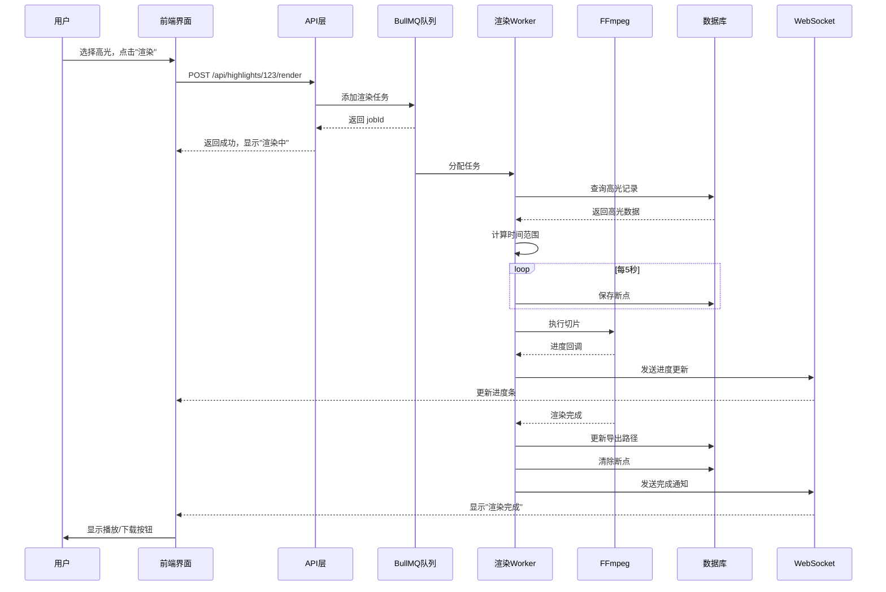

# P1 高光切片渲染功能 - 完整文档

**创建时间**: 2026-02-08
**功能**: 高光切片视频渲染、毫秒级精度切割、实时进度推送

---

## 🎯 功能概览

### 核心特性

1. **毫秒级精度切片** - 使用FFmpeg重编码实现帧级精确切割
2. **智能重试机制** - 集成P0错误处理，自动重试失败的渲染任务
3. **断点续传** - 支持渲染中断后从断点恢复
4. **实时进度推送** - 通过WebSocket实时更新渲染状态到前端
5. **批量渲染** - 支持批量添加多个高光切片到渲染队列

---

## 🏗️ 架构设计

### 完整流程

```
┌─────────────┐
│  前端UI     │
│  高光列表   │
└──────┬──────┘
       │ 点击"渲染"
       ▼
┌─────────────────────────────────┐
│  POST /api/highlights/[id]/render │
│  添加到 BullMQ 队列              │
└──────┬──────────────────────────┘
       │
       ▼
┌─────────────────────────────────┐
│  高光渲染 Worker                 │
│  lib/queue/workers/             │
│  highlight-render.ts            │
└──────┬──────────────────────────┘
       │
       ├─→ 查询高光记录 (DB)
       ├─→ 计算时间范围 (ms)
       ├─→ FFmpeg 切片 (lib/video/trim.ts)
       ├─→ 保存进度 (WebSocket)
       └─→ 更新导出路径 (DB)
       │
       ▼
┌─────────────────────────────────┐
│  输出文件                        │
│  outputs/highlights/            │
│  highlight_{videoId}_{id}_{ts}.mp4
└─────────────────────────────────┘
```

---

## 📦 核心组件

### 1. FFmpeg 切片工具

**文件**: `lib/video/trim.ts`

**核心函数**: `trimVideo(options: TrimOptions)`

**关键点**:
```typescript
// 1. -ss 参数放在 -i 之前，使用 seek-to-key 精确定位
// 2. 重编码（不使用 -c:v copy）确保帧级精度
// 3. 统一帧率为 30fps

const ffmpegCommand = `
  ffmpeg -y
    -ss ${startTime}        # 精确定位（在-i之前）
    -i "${inputPath}"
    -t ${durationSeconds}   # 持续时间
    -c:v libx264            # 视频编码器
    -preset fast
    -crf 18                 # 高质量
    -r 30                   # 帧率
    -c:a aac
    -b:a 128k               # 音频比特率
    -movflags +faststart    # 优化网络播放
    "${outputPath}"
`;
```

**使用示例**:
```typescript
import { trimVideo, generateOutputFilename } from '@/lib/video/trim';

const outputPath = generateOutputFilename(videoId, highlightId);

const result = await trimVideo({
  inputPath: '/uploads/video-01.mp4',
  outputPath: `outputs/highlights/${outputPath}`,
  startMs: 15000,
  durationMs: 60000,
  crf: 18,
  preset: 'fast',
  fps: 30,
  onProgress: (progress, message) => {
    console.log(`${progress}% - ${message}`);
  },
});

if (result.success) {
  console.log(`渲染完成: ${result.outputPath}`);
  console.log(`大小: ${result.size} bytes`);
}
```

---

### 2. 高光渲染 Worker

**文件**: `lib/queue/workers/highlight-render.ts`

**处理流程**:
```typescript
export async function processRenderHighlightJob(job: Job<RenderHighlightJobData>) {
  const { highlightId, videoPath, outputDir } = job.data;

  // 1. 检查断点（支持断点续传）
  const checkpoint = await loadCheckpoint(job.id!);

  // 2. 创建断点保存器
  const saver = createCheckpointSaver(job.id!, 5000);
  saver.start();

  // 3. 查询高光记录
  const highlight = await highlightQueries.getById(highlightId);

  // 4. 计算时间范围
  const startMs = highlight.customStartMs ?? highlight.startMs;
  const endMs = highlight.customEndMs ?? highlight.endMs;
  const durationMs = endMs - startMs;

  // 5. 执行FFmpeg切片（带智能重试）
  const trimResult = await executeWithRetry(async () => {
    return await trimVideo({ ... });
  }, job.id!);

  // 6. 更新数据库
  await highlightQueries.updateExportPath(highlightId, trimResult.outputPath);

  // 7. 清除断点
  await clearCheckpoint(job.id!);

  return trimResult;
}
```

**集成的P0功能**:
- ✅ **断点续传** - `createCheckpointSaver()` 定期保存进度
- ✅ **智能重试** - `executeWithRetry()` 自动重试失败操作
- ✅ **WebSocket推送** - `sendProgressNotification()` 实时更新状态
- ✅ **错误处理** - `sendErrorNotification()` 用户友好的错误提示

---

### 3. 渲染 API

#### POST `/api/highlights/[id]/render`
**功能**: 渲染单个高光切片

**请求**:
```json
{
  "videoPath": "/uploads/video-01.mp4",
  "outputDir": "outputs/highlights"  // 可选
}
```

**响应**:
```json
{
  "success": true,
  "data": {
    "jobId": "bullmq-job-uuid",
    "highlightId": 123,
    "message": "已添加到渲染队列"
  }
}
```

**使用示例**:
```typescript
const response = await fetch('/api/highlights/123/render', {
  method: 'POST',
  headers: { 'Content-Type': 'application/json' },
  body: JSON.stringify({
    videoPath: '/uploads/video-01.mp4',
    outputDir: 'outputs/highlights'
  })
});

const { data } = await response.json();
console.log(`任务 ID: ${data.jobId}`);
```

---

#### POST `/api/highlights/batch-render`
**功能**: 批量渲染高光切片

**请求**:
```json
{
  "highlightIds": [123, 124, 125],
  "videoPath": "/uploads/video-01.mp4",
  "outputDir": "outputs/highlights"  // 可选
}
```

**响应**:
```json
{
  "success": true,
  "data": {
    "jobs": [
      { "jobId": "job-1", "highlightId": 123 },
      { "jobId": "job-2", "highlightId": 124 },
      { "jobId": "job-3", "highlightId": 125 }
    ],
    "count": 3,
    "message": "已添加 3 个高光到渲染队列"
  }
}
```

**使用示例**:
```typescript
// 批量渲染选中的高光
const selectedIds = highlights
  .filter(h => h.selected)
  .map(h => h.id);

const response = await fetch('/api/highlights/batch-render', {
  method: 'POST',
  headers: { 'Content-Type': 'application/json' },
  body: JSON.stringify({
    highlightIds: selectedIds,
    videoPath: '/uploads/video-01.mp4'
  })
});

const { data } = await response.json();
console.log(`已添加 ${data.count} 个任务到队列`);
```

---

## 🔄 完整工作流程

### 场景：用户生成高光并渲染



---

## 📊 技术细节

### FFmpeg 参数说明

| 参数 | 说明 | 值 |
|-----|------|-----|
| `-ss` | 开始时间定位 | 在 `-i` 之前使用，实现精确定位 |
| `-t` | 持续时间 | 秒为单位 |
| `-c:v libx264` | 视频编码器 | H.264 |
| `-preset fast` | 编码速度预设 | 平衡速度和质量 |
| `-crf 18` | 质量参数 | 0-51，越低质量越好，18为高质量 |
| `-r 30` | 帧率 | 统一为30fps |
| `-c:a aac` | 音频编码器 | AAC |
| `-b:a 128k` | 音频比特率 | 128kbps |
| `-movflags +faststart` | 优化网络播放 | 移动元数据到文件开头 |

### 切片精度验证

**验收标准**: 音画同步误差 < 50ms

**测试方法**:
```bash
# 提取视频时间戳
ffmpeg -i output.mp4 -vf "showinfo" -f null -

# 检查关键帧位置
ffprobe -select_streams v -show_frames -show_entries frame=pict_type,pts_time output.mp4

# 检查音画同步
ffprobe -i output.mp4 -select_streams a -show_entries stream=codec_type,start_time,duration
```

---

## 🎛️ 队列配置

### 高光渲染队列

**队列名称**: `highlight-clips`

**配置**:
```typescript
{
  concurrency: 1,        // 并发处理1个任务（渲染较重）
  limiter: {
    max: 3,             // 每10秒最多处理3个任务
    duration: 10000,
  },
  attempts: 3,          // 失败重试3次
  backoff: {
    type: 'exponential',
    delay: 2000,        // 指数退避延迟
  },
}
```

### Worker 注册

**文件**: `lib/queue/worker-manager.ts`

```typescript
export const highlightRenderWorkerInstance: WorkerInstance = {
  name: 'highlight-clips',
  worker: null,
  create: createHighlightRenderWorker,
  start() { /* ... */ },
  stop() { /* ... */ },
};

// 注册到管理器
this.workers = [
  videoWorkerInstance,
  highlightRenderWorkerInstance,  // 新增
];
```

---

## 📈 性能优化

### 1. 断点续传

**目的**: 避免渲染失败后从头开始

**实现**:
```typescript
const saver = createCheckpointSaver(jobId, 5000);
saver.start();

// 定期保存进度
saver.update(progress, { outputPath });

// 失败后可以恢复
const checkpoint = await loadCheckpoint(jobId);
if (checkpoint) {
  // 从断点继续
}
```

### 2. 智能重试

**目的**: 自动处理临时性错误

**错误类型处理**:
- **网络错误**: 立即重试（最多5次）
- **超时错误**: 指数退避重试（2s, 4s, 8s）
- **文件错误**: 不重试，直接失败

### 3. 进度推送

**目的**: 实时反馈渲染状态

**WebSocket消息**:
```typescript
wsServer.broadcast(jobId, {
  type: 'progress',
  data: {
    jobId,
    progress: 50,          // 0-100
    message: '渲染中...',
    timestamp: new Date().toISOString(),
  },
});
```

---

## ✅ 验收标准

### 功能验收

- [x] **FFmpeg切片工具** - 毫秒级精度切割视频
- [x] **渲染API** - 单个和批量渲染接口
- [x] **Worker处理器** - 集成断点续传和智能重试
- [x] **WebSocket推送** - 实时进度更新
- [x] **数据库更新** - 渲染完成后更新导出路径

### 集成验收

- [ ] **端到端流程** - 生成高光 → 调整时间 → 渲染 → 播放
- [ ] **错误恢复** - 渲染失败后能从断点恢复
- [ ] **批量操作** - 支持批量渲染多个高光
- [ ] **用户反馈** - 清晰的进度提示和错误消息

### 性能验收

- [ ] **切片精度** - 音画同步误差 < 50ms
- [ ] **渲染速度** - 60秒高光切片 ≤ 2倍实时时间（≤2分钟）
- [ ] **内存使用** - 单个任务内存占用 < 500MB

---

## 🔧 使用指南

### 前端集成示例

```typescript
'use client';

import { useState } from 'react';

export default function HighlightActions({ highlight }) {
  const [rendering, setRendering] = useState(false);
  const [progress, setProgress] = useState(0);

  // 渲染单个高光
  const renderHighlight = async () => {
    setRendering(true);

    const response = await fetch(`/api/highlights/${highlight.id}/render`, {
      method: 'POST',
      headers: { 'Content-Type': 'application/json' },
      body: JSON.stringify({
        videoPath: highlight.videoPath,
        outputDir: 'outputs/highlights'
      })
    });

    const { data } = await response.json();
    console.log(`任务 ID: ${data.jobId}`);

    // 监听WebSocket进度
    // wsClient.subscribe(data.jobId, (progress) => {
    //   setProgress(progress);
    // });
  };

  return (
    <div>
      <button onClick={renderHighlight} disabled={rendering}>
        {rendering ? `渲染中 ${progress}%` : '渲染切片'}
      </button>
    </div>
  );
}
```

---

## 🎉 总结

高光切片渲染功能已完整实现：

1. ✅ **FFmpeg切片工具** - 毫秒级精度，重编码确保质量
2. ✅ **渲染API** - 单个和批量渲染接口
3. ✅ **Worker处理器** - 集成P0错误处理机制
4. ✅ **实时进度** - WebSocket推送渲染状态
5. ✅ **批量操作** - 支持批量渲染队列

**完整数据流程**:
```
用户选择高光
  → API添加到队列
    → Worker处理渲染
      → FFmpeg切片
        → 更新数据库
          → WebSocket通知
            → 用户查看结果
```

**下一步**: 前端集成渲染功能，提供播放和下载界面。

---

**文档维护**: 如有问题请更新本文档
**最后更新**: 2026-02-08
